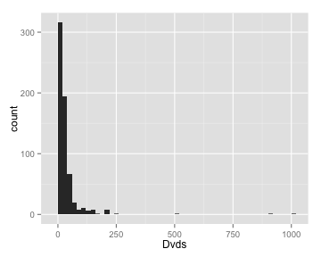
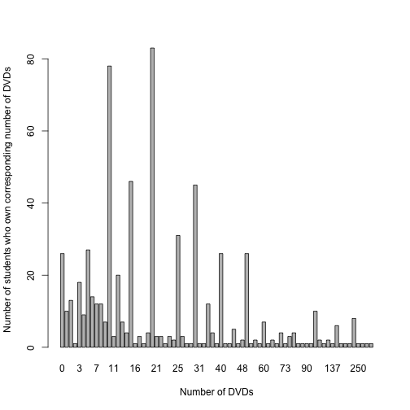
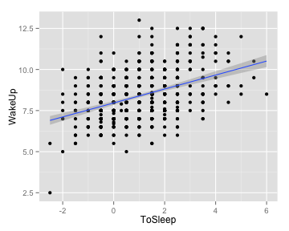

### Problem two
  

```r
# load and have a quick look of the data
library(LearnBayes)
data(studentdata)
str(studentdata)
```

```
## 'data.frame':	657 obs. of  11 variables:
##  $ Student: int  1 2 3 4 5 6 7 8 9 10 ...
##  $ Height : num  67 64 61 61 70 63 61 64 66 65 ...
##  $ Gender : Factor w/ 2 levels "female","male": 1 1 1 1 2 1 1 1 1 2 ...
##  $ Shoes  : num  10 20 12 3 4 NA 12 25 30 10 ...
##  $ Number : int  5 7 2 6 5 3 3 4 3 7 ...
##  $ Dvds   : num  10 5 6 40 6 5 53 20 40 22 ...
##  $ ToSleep: num  -2.5 1.5 -1.5 2 0 1 1.5 0.5 -0.5 2.5 ...
##  $ WakeUp : num  5.5 8 7.5 8.5 9 8.5 7.5 7.5 7 8.5 ...
##  $ Haircut: num  60 0 48 10 15 25 35 25 30 12 ...
##  $ Job    : num  30 20 0 0 17.5 0 20 0 25 0 ...
##  $ Drink  : Factor w/ 3 levels "milk","pop","water": 3 2 1 3 2 3 3 2 3 1 ...
```


```r
library(ggplot2)
ggplot(aes(x=Dvds), data=studentdata) +
  geom_histogram(binwidth =20)
```

 


```r
# Summarize the data and report the 2.5th and 97.5th percentiles.
summary(studentdata$Dvds)
```

```
##    Min. 1st Qu.  Median    Mean 3rd Qu.    Max.    NA's 
##     0.0    10.0    20.0    30.9    30.0  1000.0      16
```

```r
quantile(studentdata$Dvds, probs =c(0.025,0.5,0.975), na.rm = TRUE)
```

```
##  2.5%   50% 97.5% 
##     0    20   150
```


```r
# Constuct a table of the individual values of DVDs that were observed.
# And make a bar plot.
table(studentdata$Dvds)
```

```
## 
##    0    1    2  2.5    3    4    5    6    7    8    9   10   11   12   13 
##   26   10   13    1   18    9   27   14   12   12    7   78    3   20    7 
##   14   15   16   17 17.5   18   20   21   22 22.5   23   24   25 27.5   28 
##    4   46    1    3    1    4   83    3    3    1    3    2   31    3    1 
##   29   30   31   33   35   36   37   40   41   42   45   46   48   50   52 
##    1   45    1    1   12    4    1   26    1    1    5    1    2   26    1 
##   53   55   60   62   65   67   70   73   75   80   83   85   90   97  100 
##    2    1    7    1    2    1    4    1    3    4    1    1    1    1   10 
##  120  122  130  137  150  152  157  175  200  250  500  900 1000 
##    2    1    2    1    6    1    1    1    8    1    1    1    1
```

```r
barplot(table(studentdata$Dvds), ylab = "Number of students who own corresponding number of DVDs", xlab="Number of DVDs")
```

 


People turn to round the number to 10s for 5s when they report it. 
Very few people have a large number of DVDs.
Why is DVD number of 2.5 even possible?

===========================================================
### Problem Three 

Make a scatter plot of the student wake-up time vs. to-sleep time. Find and over plot a least-squares fit.


```r
plot(studentdata$ToSleep,studentdata$WakeUp, xlab="To-sleep Time", ylab="Wake-up Time")
fit = lm(studentdata$WakeUp~studentdata$ToSleep)
abline(fit)
```

 

```r
summary(fit)
```

```
## 
## Call:
## lm(formula = studentdata$WakeUp ~ studentdata$ToSleep)
## 
## Residuals:
##    Min     1Q Median     3Q    Max 
## -4.401 -0.963 -0.100  0.825  4.613 
## 
## Coefficients:
##                     Estimate Std. Error t value Pr(>|t|)    
## (Intercept)           7.9628     0.0618   128.8   <2e-16 ***
## studentdata$ToSleep   0.4247     0.0360    11.8   <2e-16 ***
## ---
## Signif. codes:  0 '***' 0.001 '**' 0.01 '*' 0.05 '.' 0.1 ' ' 1
## 
## Residual standard error: 1.28 on 651 degrees of freedom
##   (4 observations deleted due to missingness)
## Multiple R-squared:  0.177,	Adjusted R-squared:  0.175 
## F-statistic:  140 on 1 and 651 DF,  p-value: <2e-16
```

```r
# Predict the average wake-up time for a student who went to bed at midnight
# based on the linear fit.
wakeuptime <- fit
```


```r
# Let's exclude points with NA values in ToSleep column or WakeUp column.
good <- complete.cases(studentdata$ToSleep, studentdata$WakeUp)
goodstudentdata <- studentdata[good,]

# After removing NA values, calculate the correlation. 
cor(goodstudentdata$ToSleep, goodstudentdata$WakeUp)
```

```
## [1] 0.4201
```

```r
# Let's try to do the same thing with ggplot2, and show the 95% confident level.
ggplot(aes(x= ToSleep, y=WakeUp), data=goodstudentdata)+
  geom_point()+
  geom_smooth(method = "lm")
```

 


```r
# Make prediction for students who went to bed at midnight: ToSleep =0 
# The code is not working correctly. ?
# However we really just need the y axis intercept for the linear function. From the summary, we can see the estimated wake up time is 7.9628, with std = 0.0618.
predict(fit, data.frame(ToSleep = c(0,1)))
```

```
## Warning: 'newdata' had 2 rows but variables found have 657 rows
```

```
##      1      2      3      4      5      6      7      8      9     10 
##  6.901  8.600  7.326  8.812  7.963  8.387  8.600  8.175  7.750  9.025 
##     11     12     13     14     15     16     17     18     19     20 
##  7.963  7.538  9.025  7.538  9.025  7.750  7.963  9.025  8.175  7.326 
##     21     22     23     24     25     26     27     28     29     30 
##  8.600  8.600  8.387  8.812  7.963  7.750  8.175  8.600  8.175  8.600 
##     31     32     33     34     35     36     37     38     39     40 
##  9.237  8.600  8.812  8.387  8.175  8.387  8.175  8.812  8.600  7.750 
##     41     42     43     44     45     46     47     48     49     50 
##  8.812  7.750  8.175  7.538  7.538  8.387  9.025  8.387  8.812  7.750 
##     51     52     53     54     55     56     57     58     59     60 
##  8.600  7.750  9.025  8.812  8.600  7.963  8.175  9.662  8.175  7.963 
##     61     62     63     64     65     66     67     68     69     70 
##  7.538  8.175  9.237  7.963  8.175  7.538  8.600  8.600  7.963  8.812 
##     71     72     73     74     75     76     77     78     79     80 
##  9.025  9.237  8.600  7.750  8.175  9.237  7.538  9.025  7.750  9.449 
##     81     82     83     84     85     86     87     88     89     90 
##  8.600  9.874  8.600  9.449  9.025  8.175  8.600  8.600  9.449  8.600 
##     91     92     93     94     95     96     97     98     99    100 
##  8.175  7.538  8.175  8.812  7.963  8.812  8.812  7.963  8.175  8.600 
##    101    102    103    104    105    106    107    108    109    110 
##  8.387  7.963  8.600  9.237  7.963  8.387  8.600 10.086  8.175  8.387 
##    111    112    113    114    115    116    117    118    119    120 
##  9.025  7.963  7.538  7.963  7.750  7.538  8.175  8.387  8.387  8.387 
##    121    122    123    124    125    126    127    128    129    130 
##  7.750  8.175  8.175  8.812  8.600  7.963  8.175  8.175  8.387     NA 
##    131    132    133    134    135    136    137    138    139    140 
##  7.750  8.175  9.449  8.387  7.963  8.600  9.449  8.175  7.113  8.600 
##    141    142    143    144    145    146    147    148    149    150 
##  8.175  7.538  8.812  8.600  7.750  8.600  7.963  8.600  8.387  8.175 
##    151    152    153    154    155    156    157    158    159    160 
##  7.963  8.387  8.387  7.750  7.538  8.600  7.963  7.538  9.449  9.025 
##    161    162    163    164    165    166    167    168    169    170 
##  8.600  8.600  7.750  8.175  8.387  7.963  8.812  8.387  8.175  7.963 
##    171    172    173    174    175    176    177    178    179    180 
##  7.750  8.175  7.750  8.175  7.750  7.113  7.750  9.025  7.750  7.750 
##    181    182    183    184    185    186    187    188    189    190 
##  7.750  7.750  7.538  8.175  8.175  8.600  8.812  8.387  8.600  8.600 
##    191    192    193    194    195    196    197    198    199    200 
##  8.812  7.750  7.963  8.812  7.750  7.326  8.600  7.750  9.025  8.812 
##    201    202    203    204    205    206    207    208    209    210 
##  9.449  8.600  7.750  8.600  7.963  8.175  8.175  7.750  8.812  9.025 
##    211    212    213    214    215    216    217    218    219    220 
##  8.600  8.175  8.387  8.600  8.812  8.600  8.600  8.090  9.025  8.600 
##    221    222    223    224    225    226    227    228    229    230 
##  8.600  7.750  7.963  7.750  8.387  8.600  8.600  8.600  9.025  9.025 
##    231    232    233    234    235    236    237    238    239    240 
##  9.237  8.387  8.175 10.086  8.387  9.449  7.963  8.387  7.538  8.387 
##    241    242    243    244    245    246    247    248    249    250 
##  7.750  8.600  9.025  8.812  9.237  8.600  7.538  9.025  8.175  7.963 
##    251    252    253    254    255    256    257    258    259    260 
##  8.175  9.025  8.175  8.387  9.025  8.600  9.237  9.449  9.449  7.963 
##    261    262    263    264    265    266    267    268    269    270 
##  8.600  8.600  8.387  8.600  8.812  9.662  9.662  8.600  8.387  7.750 
##    271    272    273    274    275    276    277    278    279    280 
##  9.025  9.449  9.025  9.025  9.025  8.175  6.901  9.449  9.237  9.025 
##    281    282    283    284    285    286    287    288    289    290 
##  7.963  7.963  8.600  8.600  8.812  8.812  8.175  7.750  8.175  8.812 
##    291    292    293    294    295    296    297    298    299    300 
##  8.175  7.963  7.750  7.750  7.750  7.750  8.175  7.750  8.387  7.750 
##    301    302    303    304    305    306    307    308    309    310 
##  8.175  9.449  7.538  7.963  8.387  7.326  8.175  8.175  8.175     NA 
##    311    312    313    314    315    316    317    318    319    320 
##  9.025  8.812  7.750  7.963  8.387  8.387  8.175  7.963  8.812  7.963 
##    321    322    323    324    325    326    327    328    329    330 
##  7.326  9.449  7.750  7.963  8.812  7.750  9.449  7.750  7.326  9.237 
##    331    332    333    334    335    336    337    338    339    340 
##  9.449  9.025  9.025  8.175  8.175  8.175  8.387  7.963  8.600  8.600 
##    341    342    343    344    345    346    347    348    349    350 
## 10.299  8.600 10.086  7.963  7.963  7.750  7.113  9.025  8.175  9.025 
##    351    352    353    354    355    356    357    358    359    360 
##  8.175  7.750  8.600  7.750  8.175  8.387  8.600  8.175  8.812  8.812 
##    361    362    363    364    365    366    367    368    369    370 
##  7.963  8.387  8.812  7.538  7.963  7.963  8.600  8.387  7.750  8.600 
##    371    372    373    374    375    376    377    378    379    380 
##  8.387  8.387  7.538  9.662  7.750  8.175  7.750  7.963  8.600  7.750 
##    381    382    383    384    385    386    387    388    389    390 
##  8.600  9.025  9.025  7.963  8.387  8.812  8.175  7.963  7.538  8.812 
##    391    392    393    394    395    396    397    398    399    400 
##  8.387  8.175  7.326  9.662  8.600  8.600  9.025  7.750  8.600  8.387 
##    401    402    403    404    405    406    407    408    409    410 
##  9.662  8.600  7.963  7.750  8.812  7.750  9.025  8.600  9.237  9.025 
##    411    412    413    414    415    416    417    418    419    420 
##  8.600  8.600  7.750  7.963  7.113  9.874  9.237  9.237  7.963  8.812 
##    421    422    423    424    425    426    427    428    429    430 
##  8.387  8.175  8.812  7.538  9.874  8.812  9.025  8.600  9.025  9.025 
##    431    432    433    434    435    436    437    438    439    440 
##  8.600  8.812  8.600  8.175  7.750  7.750  8.812  8.812  8.175  8.812 
##    441    442    443    444    445    446    447    448    449    450 
##  7.963  7.538  7.538  7.750  7.326  8.387  7.963  8.175  8.387  9.025 
##    451    452    453    454    455    456    457    458    459    460 
##  8.175  7.963  8.387  8.812  7.326  9.237  7.750  7.963  8.175  8.175 
##    461    462    463    464    465    466    467    468    469    470 
##  7.326  7.963  7.750  9.449  7.326  7.538  8.600  8.600  8.175  7.963 
##    471    472    473    474    475    476    477    478    479    480 
##  7.750  7.963  8.175  8.175  8.387  7.750  7.963  8.175  8.387  7.963 
##    481    482    483    484    485    486    487    488    489    490 
##  7.750  8.600  9.662  8.600  7.750  8.387  8.600  7.750  8.387  7.750 
##    491    492    493    494    495    496    497    498    499    500 
##  8.387  8.600  8.175  8.600  7.963  8.600  8.600  8.600  8.175  8.387 
##    501    502    503    504    505    506    507    508    509    510 
##  8.387  9.662  9.025  9.025  7.963  8.175  7.963  7.963  8.600  8.600 
##    511    512    513    514    515    516    517    518    519    520 
##  8.387  9.025  8.175  7.113  8.387  8.387  8.600  8.175  8.387  9.025 
##    521    522    523    524    525    526    527    528    529    530 
##  7.538  9.025  8.387  9.449  7.750  7.963  8.175  8.812  7.113  7.538 
##    531    532    533    534    535    536    537    538    539    540 
##  8.812  9.025  7.963  8.175  8.090  7.750  8.600  8.387  8.600  9.874 
##    541    542    543    544    545    546    547    548    549    550 
## 10.299  7.963  8.600  8.387  7.750  8.812  7.963     NA  7.963  8.387 
##    551    552    553    554    555    556    557    558    559    560 
##  8.387  8.600  7.750  7.963  7.326  9.237  7.750  9.025 10.511  8.812 
##    561    562    563    564    565    566    567    568    569    570 
##  8.600  8.600  8.387  9.449  8.600  9.449  8.812  7.963  7.963  7.750 
##    571    572    573    574    575    576    577    578    579    580 
##  9.025  9.449  9.025  7.750  8.600  8.600  7.963  8.812  8.600  7.750 
##    581    582    583    584    585    586    587    588    589    590 
##  9.025  7.750  8.387  8.387  7.326  7.750  8.175  8.600  7.963  8.175 
##    591    592    593    594    595    596    597    598    599    600 
##  8.387  8.387  9.237  9.025  9.662  8.600  9.874  8.812  8.175  8.600 
##    601    602    603    604    605    606    607    608    609    610 
##  7.963  8.812  7.750  7.963  8.175  9.237  8.387  9.025  8.175  7.963 
##    611    612    613    614    615    616    617    618    619    620 
##  7.963  8.387  8.812  8.387  8.387  7.750  8.175  8.387  8.175  8.812 
##    621    622    623    624    625    626    627    628    629    630 
##  7.113  9.025  8.175  8.812  9.237  9.025  8.387  8.812  9.237  8.600 
##    631    632    633    634    635    636    637    638    639    640 
##  7.750  8.600  8.175  8.812  8.175  7.538  8.175  9.662  9.025  7.963 
##    641    642    643    644    645    646    647    648    649    650 
##  8.600  7.538  7.963  8.175  8.600  8.812  7.963  7.750  9.874  8.600 
##    651    652    653    654    655    656    657 
##  9.449  8.175  7.538  7.326  7.963  9.025  9.449
```


